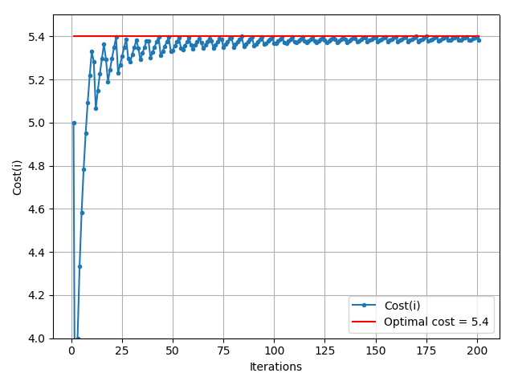

## ex09-11-shortest-path-with-time-constraints-fernandoorge

### Table of contents
* [Repo organization](#repo-organization)
* [Solution to exercise 09](#solution-to-exercise-09)
* [Solution to exercise 10](#solution-to-exercise-10)
* [Solution to exercise 11](#solution-to-exercise-11)

### Repo organization

Each exercise of the assignment is solved in a different file
* **ex09.py** for exercise 09
* **ex10.py** for exercise 10
* **ex11.py** for exercise 11
* **logistics.py** constains some useful functions developed by me. 


### Solution to exercise 09

```
1) If a person had to travel between s and t in less than 9 hours (T). 
   What’s the shortest path? Try to solve the problem with a simple LP model.
```

* SOLVING PROBLEM WITH: simplex
  * The raw solution will be        : [0. 1. 0. 0. 1. 0. 1.]
  * Arc ('s', '3') must be taken.
  * Arc ('3', '5') must be taken.
  * Arc ('5', 't') must be taken.
  * The minimum cost will be        : 5.00 
  * The best time will be           : 9.00
  
```     
2) What if the maximum available time that this person has drops to 8 hours? 
   What’s the new shortest path? Understand the LP model outputs.
```

* SOLVING PROBLEM WITH: simplex
  * The raw solution will be        : [0.2 0.8 0.  0.2 0.8 0.  0.8]
  * Arc ('s', '2') must be taken.
  * Arc ('s', '3') must be taken.
  * Arc ('2', 't') must be taken.
  * Arc ('3', '5') must be taken.
  * Arc ('5', 't') must be taken.
  * The minimum cost will be        : 5.40 
  * The best time will be           : 8.00 
* **CONCLUSION**
  * This solution is not feasible. 
  * There's no way to take two paths at a time.
  * A person cannot be splitted into two parts to take 0.2 of path ('s', '2') and 0.8 of path ('s', '3').
  * Either ('s', '2') path is taken or ('s', '3') is taken but not both.

```
3) What’s the first solution that comes to your mind in order to solve point 2 issues? 
   Is it feasible in reality?
```
* One possible solution is to restric the decision variables to be binary, any given path is taken or not.

### Solution to exercise 10
```
    1) For #EX09 and T ≤ 8 hs. apply the Lagrangian Relaxation method and find a solution iterating for   
       different values of lagrangian multipliers (λ) between 0 and 1.
```
* Solution code can be found at **ex10.py**

```
    2) Plot all the objective function primal solutions for the set of lagrangian multipliers used in 1).
```


```
    3) What should be the optimum λ related to the shortest path solution?
```

* The optimum λ is the **red-dot** in the previous figure, i.e. λ=0.4.

### Solution to exercise 11

```
For #EX09 and T ≤ 8 hs. apply the Lagrangian Relaxation method and find the shortest path iterating between several values of lagrangian multipliers using the subgradient method.
```

First we have the solution to the relaxation problem




```
SOLUTION
	# of iterations : 201
    Optimal cost    : 5.384257
    Optimal lambda  : 0.403936
    Optimal Xvector : [1. 0. 0. 1. 0. 0. 0.]
```

Then, we have to take the optimal xvector (the decision variables), and get the solution to the main problem

SOLUTION
    Optimal Xvector : [1. 0. 0. 1. 0. 0. 0.]
    Path to take    : 
		 Arc ('s', '2') must be taken.
		 Arc ('2', 't') must be taken.
    Distance        : 7
    Time            : 4
```
